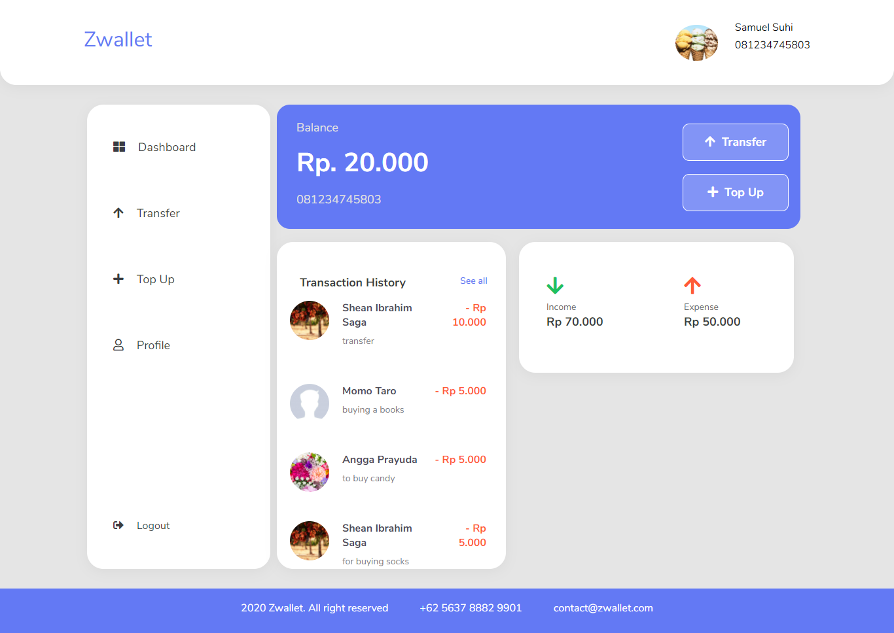

# Zwallet
Zwallet is a website application that focuses on transferring money between users. In this application users can top up balance and see a transaction history after transfer to friends. Zwallet created with modern and sleek design and not complicated, and users can be comfortable for using it.

## Features
* **Transfer money**
* **Top up balance**
* **Transaction history**
* **Update password**
* **Update PIN**
* **Add and delete phone number**
* **and others**

## Requirements
* **[Vue cli](https://cli.vuejs.org/guide/installation.html)**
* **[Backend Zwallet](https://github.com/sjasminetya/zwallet-backend)**

## Getting started
Clone the repository
```
git clone https://github.com/sjasminetya/zwallet-frontend.git
```
Install all dependencies
```
npm install
```

## Add env
Create .env.local file in your root project folder.
```
VUE_APP_URL_API = 
```

## Screenshots
<div class="flex">


</div>
